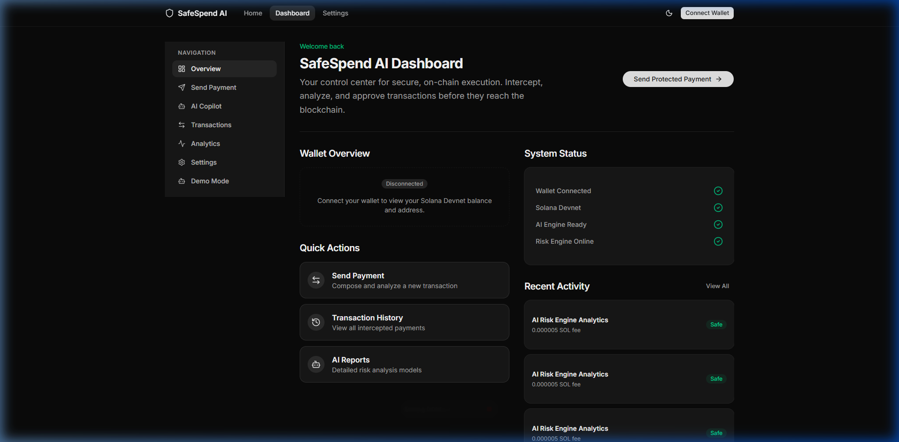
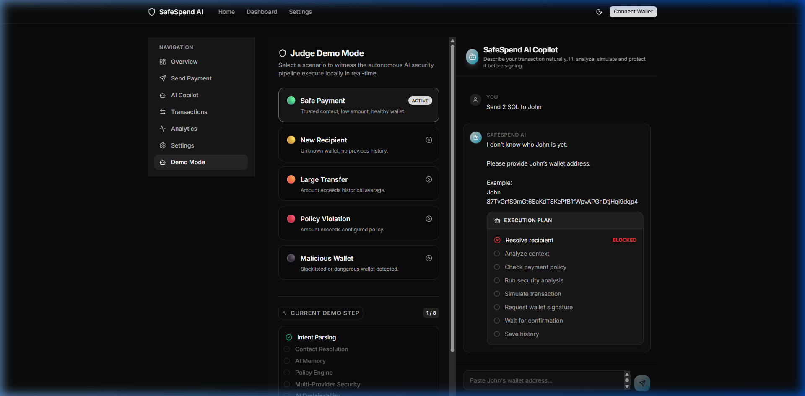
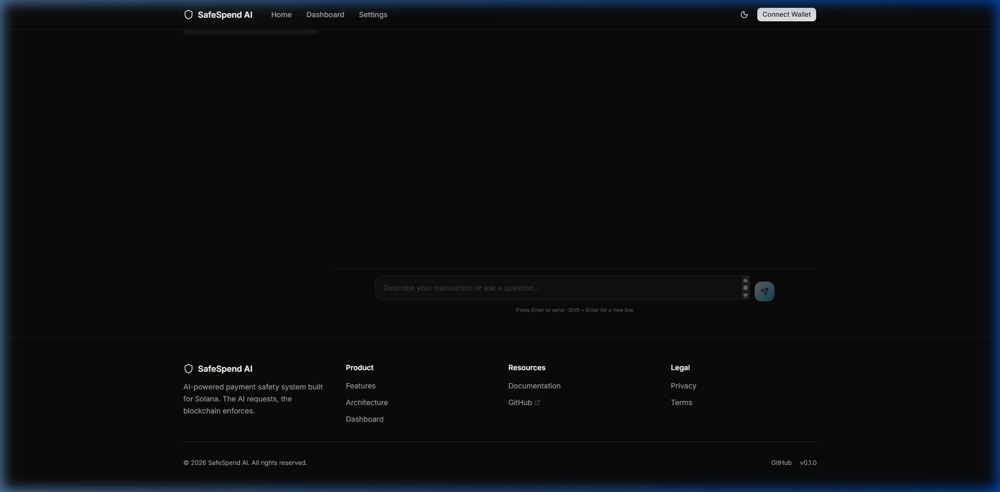
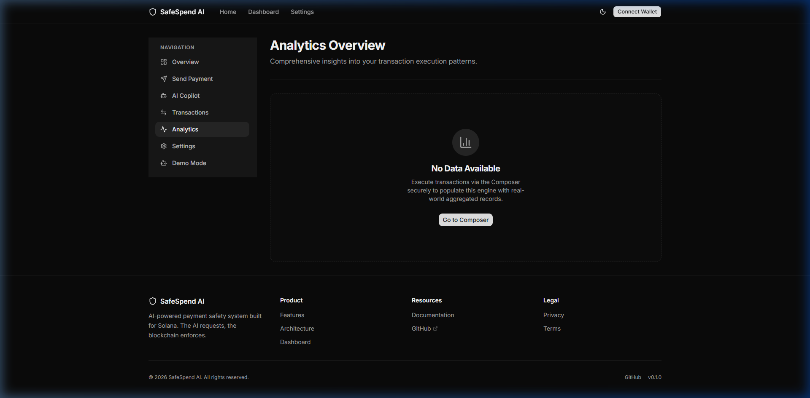
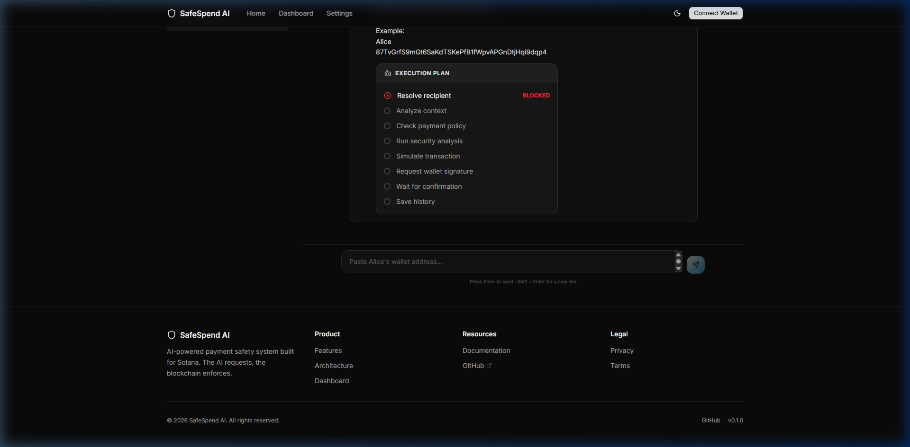
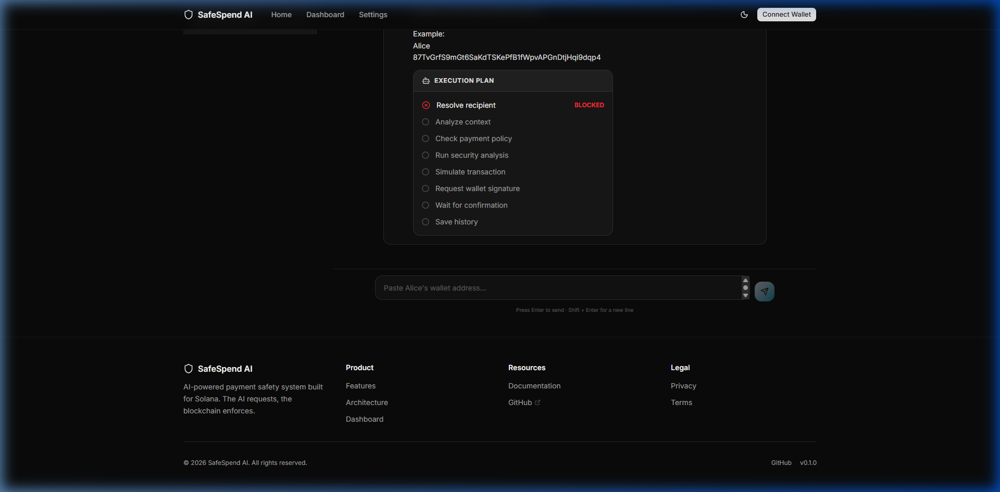
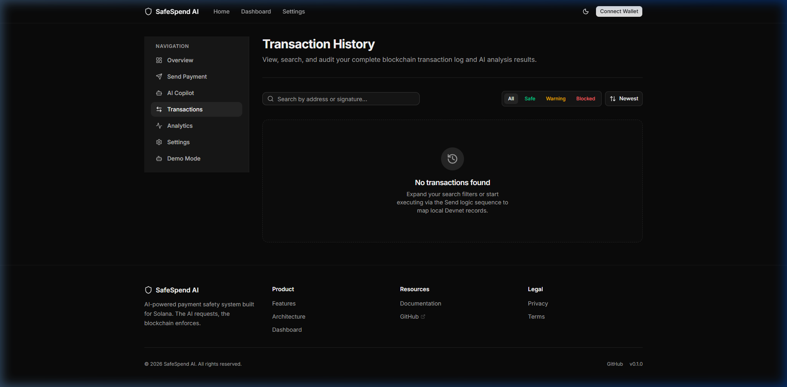

<div align="center">

# 🛡️ SafeSpend AI

**AI-powered Solana Payment Security Copilot**

<p>
  <i>Analyze. Explain. Simulate. Protect.</i>
</p>

<p>
  Protect Solana transactions before wallet signature using deterministic security analysis and an AI-powered copilot.
</p>

<br />

 
 
 


<br />

### 🔗 Quick Links

[**Live Demo**](https://safespend-ai.vercel.app) •
[**GitHub Repository**](https://github.com/YousufAziz1/safespend-ai) •
[**Demo Mode**](/demo) •
[**Documentation**](docs/)

<div align="center">
  
</div>

*(Animated capture showcasing Copilot dynamic intent parsing and real Web3 hooks).*

</div>

---

## ✨ Features

<details open>
<summary><b>🧠 AI Copilot</b></summary>
Natural language understanding that intuitively maps your intents. Resolves <code>base58</code> addresses to trusted names and provides actionable, context-aware suggestions during execution.
</details>

<details open>
<summary><b>🛡️ Security Engine</b></summary>
A multi-layered defense intercepting threats in milliseconds. Integrates <b>GoPlus</b> (global blacklists), <b>Helius</b> (wallet maturation/history), and <b>Birdeye</b> (token liquidity & honeypot checks) natively.
</details>

<details open>
<summary><b>⚡ Simulation</b></summary>
Executes live Web3 RPC Sandbox boundaries intercepting compute failures and reverts transparently across the blockchain prior to spending gas or signing with your wallet.
</details>

<details open>
<summary><b>📊 Analytics</b></summary>
Complete visualizations of your transactional risk distributions. Stores local, on-chain execution states mapped accurately for organic ledger visibility over time.
</details>

<details open>
<summary><b>⚙️ Policy Engine</b></summary>
Enforces custom maximum threshold budget constraints linked specifically to contacts, preventing dangerous drains dynamically.
</details>

<details open>
<summary><b>🧑‍⚖️ Judge Demo</b></summary>
An interactive, automated 8-step orchestrator designed precisely to verify exact execution loops and AI mappings natively directly on the platform.
</details>

<details open>
<summary><b>📕 History</b></summary>
Complete execution ledger storing final confirmed RPC signatures securely accessible strictly within the browser safely.
</details>

<details open>
<summary><b>🦞 ZeroClaw Rust Plugin</b></summary>
The deterministic security components have been completely ported to a headless Rust `#wasm-wasip` environment implementing strict WIT traits organically for native ZeroClaw integration securely!
</details>

---

## 📸 Screenshots

<div align="center">
  
  
  
  <br/><br/>
  
  
  

  <br/><br/>

  
  
  
</div>

---

## 🏗️ Architecture

SafeSpend AI's architecture utilizes deterministic rule-chains, replacing LLM hallucinations with strict functional boundaries that intercept intent sequences natively through `Action -> Extract -> Analyze -> Display -> Simulate -> Sign`.

👉 **[View the Complete System Flowcharts and Diagrams](docs/ARCHITECTURE.md)**

---

## 📂 Project Structure

```text
safespend-ai/
├── app/                  # Next.js App Router (Protected Pages & Dashboard)
├── components/           # Reusable UI Blocks (Shadcn + Radix)
├── hooks/                # Web3 & UI reactive lifecycles
├── lib/                  
│   ├── copilot/          # NLP, Planners, Memory, Explainer 
│   ├── security/         # Multi-Provider Security API Engines
│   └── storage/          # Local Storage Ledger 
├── providers/            # Top-level Global Contexts
├── docs/                 # Hackathon Submission Documents & Designs
├── types/                # Typescript Contract Definitions
└── zeroclaw-plugin/      # 🦞 Official ZeroClaw Rust/WASM Security Plugin!
```

---

## 🛠️ Tech Stack

<div align="center">

| Domain | Technology |
|---|---|
| **Frontend** | Next.js 14, React, TailwindCSS, Framer Motion, Shadcn UI |
| **Blockchain** | Solana Web3.js, Wallet Adapter, Phantom |
| **Security APIs** | GoPlus Security, Helius RPC, Birdeye Data |
| **State** | React Context & Native LocalStorage |
| **Deployment** | Vercel Serverless Functions |

</div>

---

## 🚀 Installation & Setup

1. **Clone the repository:**
   ```bash
   git clone https://github.com/YousufAziz1/safespend-ai.git
   cd safespend-ai
   ```

2. **Install dependencies:**
   ```bash
   pnpm install
   ```

3. **Configure Environment:**
   ```bash
   cp .env.example .env.local
   ```
   *Edit `.env.local` to securely include your keys. (See Environment Variables below)*

4. **Start the application:**
   ```bash
   pnpm dev
   ```

---

## 🔐 Environment Variables

| Variable | Description |
|---|---|
| `NEXT_PUBLIC_HELIUS_API_KEY` | Required to route wallet creation dates and history metrics against Helius RPC nodes safely. |
| `NEXT_PUBLIC_GOPLUS_API_KEY` | Authenticates REST queries scanning active global phishing links and malicious smart contracts. |
| `NEXT_PUBLIC_BIRDEYE_API_KEY` | Provides GraphQL endpoints inspecting SPL Token mechanics, detecting honeypots and low liquidity. |

---

## 🧭 Usage

- **Dashboard:** At-a-glance active overview visualizing recent interaction risks and execution history.
- **Send:** Traditional Web3 primitive form wrapped securely around the Multi-Provider execution checks.
- **Copilot:** The transactional NLP brain parsing natural intents and orchestrating live explanations smoothly.
- **Demo:** Specifically engineered Orchestrator automatically tracking hackathon edge-cases flawlessly.
- **Analytics:** Aggregate risk modeling plotting deployment safety dynamically mapping interactions natively.
- **History:** Verifiable local ledger extracting final RPC payload histories.

---

## 🤝 Contributors

Built and maintained by **Yousuf Aziz**.

*AI-assisted development workflows were used during implementation and documentation.*

---

## 📄 License
This project is licensed under the MIT License - see the LICENSE file for details.
