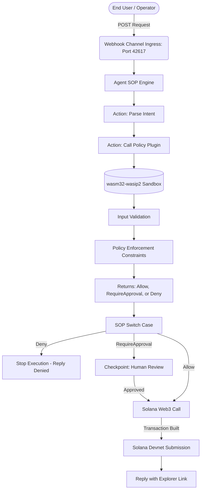

# SafeSpend AI Architecture 🏗️

This document outlines the strict execution pathways mapping intent payloads across the policy engine and webhook channels accurately.

## 1. ZeroClaw Target Interaction System

## 2. Capability Claims

The workflow maps capabilities strictly utilizing offline deterministic functions avoiding live network bloat.

| Claim | Component File | Execution Target |
|---|---|---|
| **JSON Argument Parsing** | `zeroclaw-plugin/src/lib.rs` | Standard `serde_json` mapping parameters |
| **Stateless Threat Verification** | `zeroclaw-plugin/src/lib.rs` | Local execution returning structured Enum codes |
| **Webhook Ingress Channel** | `zeroclaw/agent.yml` | Maps external UI commands triggering pipeline |
| **Policy State Orchestration** | `zeroclaw/sop.yml` | Governs the flow of approvals handling conditional branches |

## 3. Explicit File Boundaries

1. **`zeroclaw-plugin`**: Entirely sandboxed Rust logic enforcing static tests defining rule limits locally.
2. **`zeroclaw/sop.yml`**: The instruction controller defining state interactions governing exactly when human input intercepts an instruction securely preventing automated key exposure.
3. **`docs/SECURITY.md`**: Provides exact documentation differentiating input formatting constraints from absolute policy bounds.
