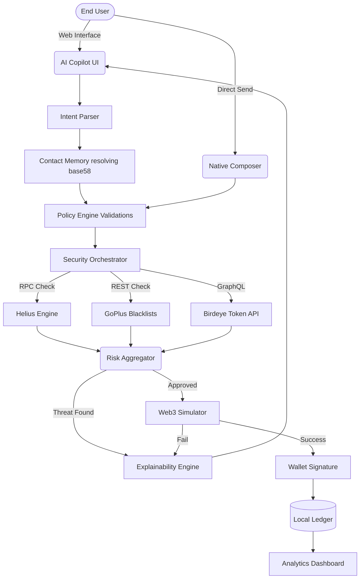
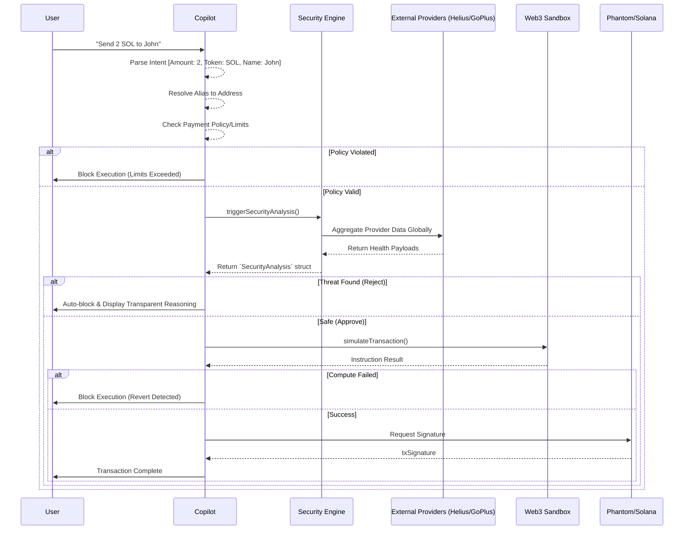

# SafeSpend AI Architecture 🏗️

This document outlines the strict workflows mapping intent pipelines through complex multi-provider security engines reliably.

## 1. Top-Level Ecosystem Architecture

## 2. Complete Transaction Lifecycle (System Flow)

